<div class="ib-hero" markdown>

# Iron Bank Protocol

## *From Zero to Cloud Security Engineer in 12 Months*

A structured, project-driven curriculum for security professionals transitioning into **Cloud Security**, **AppSec**, and **DevSecOps**. No prior scripting or cloud experience required — every concept is built from the ground up.

<div class="ib-hero__buttons" markdown>

[🚀 Start Learning — Phase 1](phase1/index.md){ .md-button .md-button--primary }
[🎯 Four Phases Overview](#four-phases-one-career){ .md-button }
[📚 Resources Library](resources.md){ .md-button }

</div>
</div>

---

## 📊 What's Inside

<div class="grid cards ib-stats" markdown>

-   :material-calendar-month:{ .ib-stat-icon } **12 Months**

    ---

    Week-by-week structured curriculum with clear milestones, checkpoints, and no hand-waving

-   :material-certificate-outline:{ .ib-stat-icon } **6 Certifications**

    ---

    AWS CCP → Terraform Assoc → SAA-C03 → Security Specialty → CDP → CCSP

-   :material-flask-outline:{ .ib-stat-icon } **20+ Hands-On Labs**

    ---

    Real tools: Semgrep, Trivy, ZAP, Falco, ArgoCD, OPA, GuardDuty and more

-   :material-briefcase-outline:{ .ib-stat-icon } **12 Portfolio Projects**

    ---

    Ship a CIS audit script, AWS scanner, DevSecOps pipeline, and a full IR simulation

-   :material-clock-outline:{ .ib-stat-icon } **~800 Hours**

    ---

    15–18 hrs/week — designed to fit around a full-time job or studies

-   :material-currency-usd-off:{ .ib-stat-icon } **$0 Monthly Cost**

    ---

    Labs use free tiers with strict cleanup steps to avoid surprise AWS bills

</div>

---

## 🎯 Four Phases, One Career { #four-phases-one-career }

<div class="ib-phase-grid">

  <div class="ib-phase-card ib-phase-card--1">
    <div class="ib-phase-card__header">
      <span class="ib-phase-card__icon">🐧</span>
      <div>
        <div class="ib-phase-card__title">Phase 1 · Foundation</div>
        <div class="ib-phase-card__months">Months 1 – 3</div>
      </div>
    </div>
    <p class="ib-phase-card__desc">Master the terminal, scripting, and AWS basics — the bedrock of every security engineering role.</p>
    <div class="ib-phase-card__section-label">Skills you'll build</div>
    <ul class="ib-phase-card__skills">
      <li>Linux CLI, <code>grep</code>, <code>awk</code>, pipe chains</li>
      <li>Bash scripting for security automation</li>
      <li>Python from scratch → <code>boto3</code> AWS SDK</li>
      <li>AWS IAM, S3 &amp; KMS deep dives</li>
    </ul>
    <div class="ib-phase-card__section-label">Labs &amp; Projects</div>
    <ul class="ib-phase-card__labs">
      <li>🔨 CIS Benchmark Audit Script</li>
      <li>🔨 AWS Security Scanner</li>
      <li>🔬 IAM Privilege Escalation Lab</li>
      <li>🎓 AWS Cloud Practitioner Exam</li>
    </ul>
    <a href="phase1/" class="ib-phase-card__btn ib-phase-card__btn--1">Start Phase 1 →</a>
  </div>

  <div class="ib-phase-card ib-phase-card--2">
    <div class="ib-phase-card__header">
      <span class="ib-phase-card__icon">☁️</span>
      <div>
        <div class="ib-phase-card__title">Phase 2 · Cloud Security</div>
        <div class="ib-phase-card__months">Months 4 – 6</div>
      </div>
    </div>
    <p class="ib-phase-card__desc">Design secure AWS architectures, write infrastructure as code, and build detection pipelines.</p>
    <div class="ib-phase-card__section-label">Skills you'll build</div>
    <ul class="ib-phase-card__skills">
      <li>VPC design, subnets, routing, NACLs</li>
      <li>Terraform — modules, state, OPA policies</li>
      <li>GuardDuty, AWS Config, Security Hub</li>
      <li>Zero Trust enforcement with SCPs</li>
    </ul>
    <div class="ib-phase-card__section-label">Labs &amp; Projects</div>
    <ul class="ib-phase-card__labs">
      <li>🔬 Threat Modeling Bootcamp</li>
      <li>🔨 VPC Flow Logs Analyzer</li>
      <li>🔨 Iron Bank Architecture in Terraform</li>
      <li>🎓 Terraform Associate Exam</li>
    </ul>
    <a href="phase2/" class="ib-phase-card__btn ib-phase-card__btn--2">Start Phase 2 →</a>
  </div>

  <div class="ib-phase-card ib-phase-card--3">
    <div class="ib-phase-card__header">
      <span class="ib-phase-card__icon">🔐</span>
      <div>
        <div class="ib-phase-card__title">Phase 3 · Application Security</div>
        <div class="ib-phase-card__months">Months 7 – 9</div>
      </div>
    </div>
    <p class="ib-phase-card__desc">Learn how attackers think, then master the tools that catch vulnerabilities before they ship.</p>
    <div class="ib-phase-card__section-label">Skills you'll build</div>
    <ul class="ib-phase-card__skills">
      <li>OWASP Top 10 + API Top 10 exploitation</li>
      <li>SAST with Semgrep, DAST with OWASP ZAP</li>
      <li>SCA: Trivy (containers) + Gitleaks (secrets)</li>
      <li>Docker hardening, K8s Pod Security, Falco</li>
    </ul>
    <div class="ib-phase-card__section-label">Labs &amp; Projects</div>
    <ul class="ib-phase-card__labs">
      <li>🔬 OWASP Exploitation Lab</li>
      <li>🔨 Security Testing Toolkit</li>
      <li>🔬 Kubernetes Security Hardening Lab</li>
      <li>🎓 AWS SAA-C03 + SCS-C03 Exams</li>
    </ul>
    <a href="phase3/" class="ib-phase-card__btn ib-phase-card__btn--3">Start Phase 3 →</a>
  </div>

  <div class="ib-phase-card ib-phase-card--4">
    <div class="ib-phase-card__header">
      <span class="ib-phase-card__icon">🚀</span>
      <div>
        <div class="ib-phase-card__title">Phase 4 · DevSecOps</div>
        <div class="ib-phase-card__months">Months 10 – 12</div>
      </div>
    </div>
    <p class="ib-phase-card__desc">Build the security pipeline that protects a real production system — and prove it in a capstone.</p>
    <div class="ib-phase-card__section-label">Skills you'll build</div>
    <ul class="ib-phase-card__skills">
      <li>GitHub Actions security gates (7 checkpoints)</li>
      <li>GitOps with ArgoCD, blue-green deployments</li>
      <li>Compliance as Code: PCI-DSS, HIPAA, SOC 2</li>
      <li>Incident Response — full 7-phase IR runbook</li>
    </ul>
    <div class="ib-phase-card__section-label">Labs &amp; Projects</div>
    <ul class="ib-phase-card__labs">
      <li>🔨 7-Gate DevSecOps CI/CD Pipeline</li>
      <li>🔨 Compliance Automation (Lambda + Config)</li>
      <li>🔨 Full IR Simulation Capstone</li>
      <li>🎓 CDP (Practical Exam) + CCSP</li>
    </ul>
    <a href="phase4/" class="ib-phase-card__btn ib-phase-card__btn--4">Start Phase 4 →</a>
  </div>

</div>

---

## 🔨 Labs & Projects at a Glance

<div class="grid cards ib-project-grid" markdown>

-   :material-console:{ .lg .middle } **CIS Benchmark Audit Script**

    ---

    Bash script that checks a Linux system against CIS Level 1 controls and outputs a colour-coded pass/fail report.

    `Bash` · `Linux` · `CIS Controls`

-   :material-cloud-search:{ .lg .middle } **AWS Security Scanner**

    ---

    Python + boto3 tool that scans your AWS account for misconfigurations — open S3 buckets, over-privileged IAM, unencrypted EBS.

    `Python` · `boto3` · `IAM` · `S3`

-   :material-map-legend:{ .lg .middle } **Threat Modeling Bootcamp**

    ---

    STRIDE threat model workshop for a real three-tier web application. Outputs a prioritised threat register.

    `STRIDE` · `DFD` · `Risk Rating`

-   :material-lan:{ .lg .middle } **VPC Flow Logs Analyzer**

    ---

    Parse VPC Flow Logs to detect port scans, data exfiltration patterns, and unusual traffic flows.

    `Python` · `VPC` · `CloudTrail` · `Pandas`

-   :material-terraform:{ .lg .middle } **Iron Bank IaC Architecture**

    ---

    Full Terraform module set: VPC, IAM roles, S3 + KMS, Security Groups — with Terratest and OPA policy gates.

    `Terraform` · `OPA` · `Terratest` · `tfsec`

-   :material-test-tube:{ .lg .middle } **Security Testing Toolkit**

    ---

    Compose Semgrep, OWASP ZAP, Trivy, and Gitleaks into a single scanning workflow with unified JSON reporting.

    `Semgrep` · `ZAP` · `Trivy` · `Gitleaks`

-   :material-pipe:{ .lg .middle } **7-Gate DevSecOps Pipeline**

    ---

    GitHub Actions workflow with seven security checkpoints: secrets scan → SAST → IaC scan → dependency audit → container scan → DAST → runtime.

    `GitHub Actions` · `ArgoCD` · `Falco`

-   :material-check-decagram:{ .lg .middle } **Compliance Automation**

    ---

    AWS Lambda + Config Rules that auto-remediate non-compliant resources and generate PCI-DSS, HIPAA, and SOC 2 evidence reports.

    `Lambda` · `Config` · `CloudTrail` · `SNS`

-   :material-fire-alert:{ .lg .middle } **Full Incident Response Simulation**

    ---

    7-phase IR capstone: reconnaissance detection, lateral movement investigation, containment, eradication, and post-mortem.

    `GuardDuty` · `CloudTrail` · `Step Functions`

</div>

---

## 🎓 Certification Roadmap

```mermaid
graph LR
    A["🟢 Start\nNo certs"] -->|Month 3| B["🎓 AWS CCP\nCLF-C02\n$100"]
    B -->|Month 6| C["🎓 Terraform\nAssociate 004\n$70"]
    C -->|Month 7| D["🎓 AWS SAA\nSAA-C03\n$150"]
    D -->|Month 9| E["🎓 AWS Security\nSpecialty SCS-C03\n$300"]
    E -->|Month 11| F["🎓 CDP\nPractical DevSecOps\n$899"]
    F -->|Month 12| G["🎓 CCSP\nISC2\n$599"]

    style A fill:#2d7a2d,color:#fff,stroke:#1a5e1a
    style B fill:#1a56a5,color:#fff,stroke:#0f3a74
    style C fill:#1a56a5,color:#fff,stroke:#0f3a74
    style D fill:#7b2fa0,color:#fff,stroke:#521f6b
    style E fill:#7b2fa0,color:#fff,stroke:#521f6b
    style F fill:#b85c00,color:#fff,stroke:#7a3d00
    style G fill:#b85c00,color:#fff,stroke:#7a3d00
```



| # | Certification | Month | Cost | Format |
|---|---|:---:|:---:|---|
| 1 | **AWS Cloud Practitioner** (CLF-C02) | 3 | $100 | 90 min · 65 Qs · pass 700/1000 |
| 2 | **Terraform Associate** (004) | 6 | $70.50 | 60 min · ~57 Qs · free retake |
| 3 | **AWS Solutions Architect Assoc** (SAA-C03) | 7 | $150 | 130 min · 65 Qs · pass 720/1000 |
| 4 | **AWS Security Specialty** (SCS-C03) | 9 | $300 | 170 min · 65 Qs · pass 750/1000 |
| 5 | **Certified DevSecOps Professional** (CDP) | 11 | $899 | 6-hr practical · pass 80/100 |
| 6 | **CCSP** (ISC2) | 12 | $599 | 150 min · 150 Qs · pass 700/1000 |

---

## 👤 Who This Is For

<div class="grid cards" markdown>

-   :material-shield-account:{ .lg .middle } **Security Analysts & SOC Engineers**

    ---

    You understand threats but want to move from reactive (detecting) to proactive (building secure systems). This curriculum bridges SOC → DevSecOps.

-   :material-microsoft-azure:{ .lg .middle } **Microsoft / Azure Security Professionals**

    ---

    Already know Sentinel, Defender, Entra ID, or AZ-500 concepts? Every AWS service is mapped to its Azure equivalent so you build on existing knowledge.

-   :material-shield-lock-outline:{ .lg .middle } **SC-100 / AZ-500 Holders**

    ---

    You have the architecture mindset. This curriculum adds hands-on implementation skills and cloud-agnostic tooling to complement your certifications.

-   :material-school-outline:{ .lg .middle } **Complete Beginners to Scripting**

    ---

    Every command is explained word-by-word. Every script has line-by-line comments. Every lab has expected output. No prior programming assumed.

</div>

!!! tip "Coming from a Microsoft / Azure background?"

    Every AWS service in this curriculum is mapped to its Azure equivalent so you always have a familiar reference point.

    | Microsoft / Azure | AWS Equivalent |
    |---|---|
    | Sentinel (SIEM) | CloudTrail + GuardDuty + Security Lake |
    | Entra ID / Azure AD | IAM + IAM Identity Center |
    | Conditional Access | IAM Conditions + SCPs + VPC Endpoint Policies |
    | Defender for Cloud (CSPM) | Security Hub + AWS Config + Inspector |
    | Azure Key Vault | AWS KMS + Secrets Manager |
    | Azure Policy / Blueprints | AWS Config Rules + SCPs + Control Tower |
    | Azure NSGs | Security Groups + NACLs |
    | Logic Apps (SOAR) | EventBridge + Lambda + Step Functions |

---

## ⏱️ Time Commitment

<div class="grid cards" markdown>

-   :material-calendar-today:{ .lg .middle } **Weekdays**

    ---

    **1.5–2 hours/day** — work through one topic section, run one lab

-   :material-calendar-weekend:{ .lg .middle } **Weekends**

    ---

    **3–4 hours/day** — deeper project work, exam prep, review

-   :material-chart-timeline-variant:{ .lg .middle } **Total**

    ---

    **~15–18 hrs/week** → ~800 hours over 12 months

-   :material-book-open-variant:{ .lg .middle } **Each Month**

    ---

    Weeks 1–2 = Theory + Labs · Week 3 = Project · Week 4 = Cert prep

</div>

---

## 🚀 Quick Start

!!! abstract "Start here — three steps to your first lab"

    **Step 1 — Get your environment ready**

    ```bash
    # Clone the repo
    git clone https://github.com/YOUR_USERNAME/iron-bank-protocol
    cd iron-bank-protocol

    # Install MkDocs to browse the docs locally
    pip install mkdocs-material

    # Serve the docs at http://localhost:8000
    mkdocs serve
    ```

    **Step 2 — Open Phase 1**

    Navigate to [Foundation → Linux CLI → Environment Setup](phase1/linux-environment-setup.md) and follow the setup page for your OS.

    **Step 3 — Work through the curriculum**

    Each week page has a checklist at the bottom. Complete it before moving on. When stuck, ask your AI assistant:
    *"Read this page and explain [topic] to me like I'm a beginner."*

---

<div class="ib-footer-cta" markdown>

**Ready to level up your security career?**

[🚀 Start Phase 1 — Foundation](phase1/index.md){ .md-button .md-button--primary }
[📚 Browse All Resources](resources.md){ .md-button }
[❓ Q&A Archive](qa/index.md){ .md-button }

</div>
