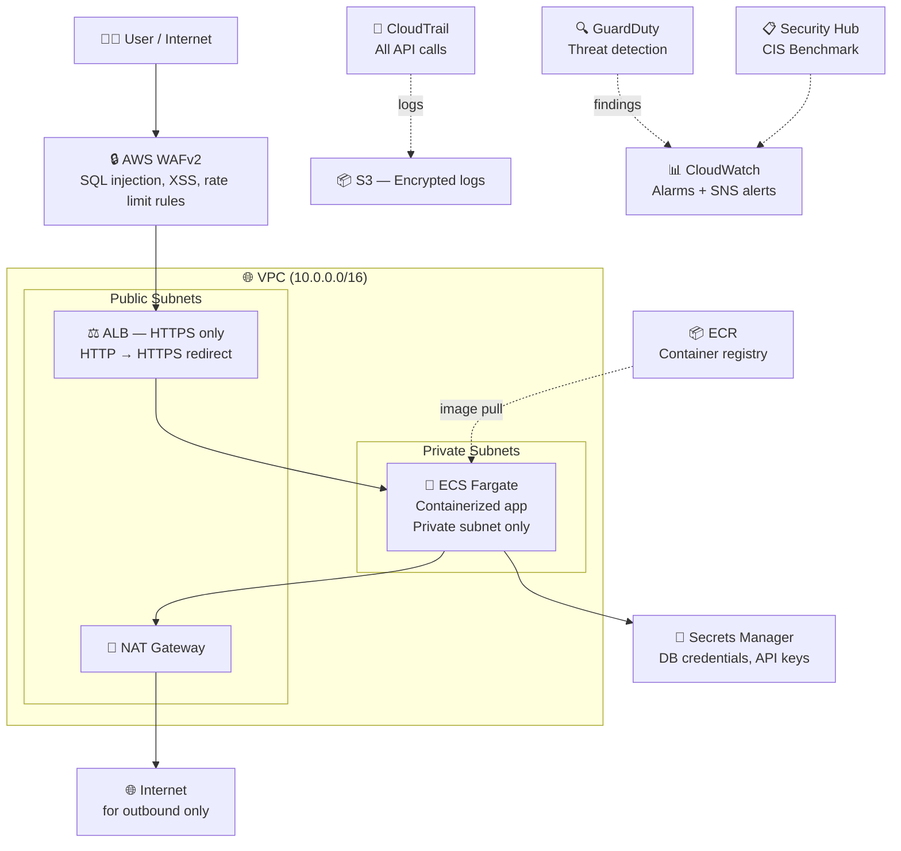

# Month 12 — Week 1: Capstone Infrastructure Deploy

!!! danger "💰 Capstone Cost Strategy"
    Deploy in the morning. Work on it during the day. Run `./cleanup.sh` before bed. Re-deploy tomorrow.

    **Daily cost while deployed:** ~$2.50–3.50/day (NAT Gateway $1.08 + ALB $0.54 + ECS Fargate ~$0.50 + GuardDuty ~$0.40 + misc)

    **Total Month 12 estimate:** ~$20–40 if you destroy every evening.

    Biggest costs: NAT Gateway ($1.08/day), ALB ($0.54/day), ECS Fargate (~$0.50/day).

!!! info "Background Context"
    This week you deploy the Iron Bank Fortress — a production-grade AWS architecture that combines everything from the last 11 months: VPC (Month 4), Terraform modules (Month 5), GuardDuty + Security Hub (Month 6), Docker + ECS Fargate (Month 9), and the security pipeline (Month 10). Hiring managers in Cloud Security and DevSecOps roles look for candidates who've deployed and *owned* a full stack. This is that stack.

---

## What You're Building

The Iron Bank Fortress is a complete cloud security showcase:



**Security properties of this architecture:**

- ECS Fargate runs in a **private subnet** — no public IP, unreachable from internet directly
- All inbound traffic flows through WAF → ALB → ECS (3-layer filtering)
- Outbound traffic exits through a NAT Gateway (ECS can reach the internet, but internet can't reach ECS)
- Secrets Manager holds credentials (not environment variables in plain text)
- CloudTrail records every AWS API call to an encrypted, tamper-evident S3 bucket
- GuardDuty monitors for suspicious activity (unusual API calls, coin mining, port scanning)
- Security Hub aggregates findings and measures CIS AWS Foundations Benchmark compliance

---

## Pre-Deploy Checklist

Before running `terraform apply`, confirm you have everything from prior months:

```bash
# 1. Confirm you have the iron-bank AWS profile
aws sts get-caller-identity --profile iron-bank
# → Should show your Account ID, no errors

# 2. Confirm Terraform is installed
terraform version
# → Terraform v1.x.x or later

# 3. Confirm Docker is installed (you'll build the app image)
docker --version
# → Docker version 24.x or later

# 4. Confirm the AWS CLI is configured
aws s3 ls --profile iron-bank
# → Lists your S3 buckets (or empty list — no error means auth works)

# 5. Check your Month 5 Terraform modules are available
ls ~/projects/iron-bank-tf/modules/
# → Should show: vpc/  ecs/  ecr/  alb/  security-groups/  (or similar)
```

!!! warning "If your Month 5 modules don't exist"
    If you skipped or only partially completed Month 5, the Capstone Terraform will reference missing modules. The fastest fix: create the `iron-bank-fortress` repository fresh (see below) — it includes its own self-contained Terraform that doesn't depend on external modules.

---

## Repository Setup

The Capstone lives in its own repository to keep it separate from your Month 5 modules and Month 10 pipeline:

```bash
mkdir -p ~/projects/iron-bank-fortress
cd ~/projects/iron-bank-fortress

# Create the top-level directory structure
mkdir -p terraform/environments/prod
mkdir -p terraform/modules/{vpc,ecr,ecs,alb,waf,monitoring,secrets}
mkdir -p app
mkdir -p scripts

# Initialize git
git init
git checkout -b main
```

---

## The Application

The Capstone needs something to run inside ECS. Use a minimal Python Flask app — simple enough to not distract from the security architecture:

```bash
cat > app/app.py << 'EOF'
"""
Iron Bank Fortress — Capstone Application
A minimal Flask app to demonstrate the security architecture.
In a real job this would be your company's actual application.
"""
import os
import boto3
import json
from flask import Flask, jsonify

app = Flask(__name__)

@app.route('/health')
def health():
    """ALB Target Group health check endpoint — must return 200."""
    return jsonify({"status": "healthy", "service": "iron-bank-fortress"}), 200

@app.route('/')
def index():
    """Main endpoint — reads a non-sensitive value from Secrets Manager."""
    # boto3 automatically uses the ECS task role — no hardcoded credentials
    client = boto3.client('secretsmanager', region_name='us-east-1')
    try:
        secret = client.get_secret_value(SecretId='iron-bank/app-config')
        config = json.loads(secret['SecretString'])
        env = config.get('environment', 'unknown')
        return jsonify({"message": f"Iron Bank Fortress — {env} environment"}), 200
    except Exception as e:
        # Don't expose the error details externally — log it, return generic message
        app.logger.error(f"Secret fetch error: {e}")
        return jsonify({"message": "Iron Bank Fortress"}), 200

if __name__ == '__main__':
    app.run(host='0.0.0.0', port=8080)
EOF

cat > app/requirements.txt << 'EOF'
flask==3.0.0
boto3==1.34.0
gunicorn==21.2.0
EOF

# Dockerfile — hardened for production
cat > app/Dockerfile << 'EOF'
# Use a specific version tag (not :latest) for reproducibility
FROM python:3.11-slim-bookworm

# Run as non-root user — security best practice
# (Trivy in Gate 4 will flag containers running as root)
RUN groupadd --gid 1001 appgroup && \
    useradd --uid 1001 --gid appgroup --no-create-home appuser

# Set working directory
WORKDIR /app

# Copy and install dependencies first (Docker layer caching — faster rebuilds)
COPY requirements.txt .
RUN pip install --no-cache-dir -r requirements.txt

# Copy application code
COPY app.py .

# Switch to non-root user
USER appuser

# Expose the port the app listens on
EXPOSE 8080

# Use gunicorn (production WSGI server) instead of Flask's dev server
CMD ["gunicorn", "--bind", "0.0.0.0:8080", "--workers", "2", "app:app"]
EOF
```

---

## Terraform: Core Infrastructure

### Provider and backend

```bash
cat > terraform/environments/prod/main.tf << 'EOF'
terraform {
  required_version = ">= 1.5"

  required_providers {
    aws = {
      source  = "hashicorp/aws"
      version = "~> 5.0"
    }
  }

  # Store Terraform state in S3 so it's not lost between sessions
  # (Create this S3 bucket manually BEFORE running terraform init)
  backend "s3" {
    bucket  = "iron-bank-terraform-state"   # replace with your unique bucket name
    key     = "fortress/prod/terraform.tfstate"
    region  = "us-east-1"
    profile = "iron-bank"
    encrypt = true                           # state file encrypted at rest
  }
}

provider "aws" {
  region  = "us-east-1"
  profile = "iron-bank"

  default_tags {
    tags = {
      Project     = "iron-bank-fortress"
      Environment = "prod"
      ManagedBy   = "terraform"
    }
  }
}
EOF
```

### Create the Terraform state bucket first

```bash
# This bucket must exist BEFORE `terraform init` — create it manually
aws s3api create-bucket \
  --bucket iron-bank-terraform-state-$(aws sts get-caller-identity \
    --profile iron-bank --query Account --output text) \
  --region us-east-1 \
  --profile iron-bank

# Enable versioning (lets you recover from accidental state file corruption)
aws s3api put-bucket-versioning \
  --bucket iron-bank-terraform-state-$(aws sts get-caller-identity \
    --profile iron-bank --query Account --output text) \
  --versioning-configuration Status=Enabled \
  --profile iron-bank

# Enable encryption (state files can contain sensitive values)
aws s3api put-bucket-encryption \
  --bucket iron-bank-terraform-state-$(aws sts get-caller-identity \
    --profile iron-bank --query Account --output text) \
  --server-side-encryption-configuration \
    '{"Rules":[{"ApplyServerSideEncryptionByDefault":{"SSEAlgorithm":"AES256"}}]}' \
  --profile iron-bank

echo "✅ Terraform state bucket created"
```

??? note "Why store Terraform state in S3?"
    Terraform tracks what resources it created in a file called `terraform.tfstate`. If this file is stored locally and you delete it (or switch machines), Terraform loses track of your infrastructure — it will try to create everything again, causing conflicts or duplicate resources.

    Storing state in S3 means: it's always there when you re-deploy tomorrow, it's encrypted, and it's versioned (you can roll back if you accidentally corrupt it).

### VPC module

```bash
cat > terraform/environments/prod/vpc.tf << 'EOF'
module "vpc" {
  source = "../../modules/vpc"

  # Basic settings
  name             = "iron-bank-fortress"
  cidr_block       = "10.0.0.0/16"   # 65,536 IP addresses total

  # Two public subnets (different AZs for high availability)
  public_subnets   = ["10.0.1.0/24", "10.0.2.0/24"]   # /24 = 256 IPs each

  # Two private subnets (ECS tasks live here — no direct internet access)
  private_subnets  = ["10.0.10.0/24", "10.0.11.0/24"]

  availability_zones = ["us-east-1a", "us-east-1b"]

  # Single NAT Gateway (one AZ only — saves ~$1/day vs two NAT Gateways)
  # In production you'd use one per AZ for resilience — but cost matters here
  enable_nat_gateway   = true
  single_nat_gateway   = true

  # VPC Flow Logs — records all network traffic in/out of your VPC
  # Required for CIS AWS Foundations Benchmark (Section 3)
  enable_flow_log      = true
  flow_log_destination = "cloud-watch-logs"
}
EOF
```

### ECR (container registry)

```bash
cat > terraform/environments/prod/ecr.tf << 'EOF'
resource "aws_ecr_repository" "app" {
  name                 = "iron-bank-fortress"
  image_tag_mutability = "IMMUTABLE"   # once pushed, an image tag cannot be overwritten
                                        # prevents accidental overwrite of a known-good image

  image_scanning_configuration {
    scan_on_push = true    # automatically scan images for CVEs when pushed
  }

  encryption_configuration {
    encryption_type = "KMS"   # encrypt images at rest with a KMS key
  }
}

# Lifecycle policy: keep only the 10 most recent images to control storage costs
resource "aws_ecr_lifecycle_policy" "app" {
  repository = aws_ecr_repository.app.name

  policy = jsonencode({
    rules = [{
      rulePriority = 1
      description  = "Keep last 10 images"
      selection = {
        tagStatus   = "any"
        countType   = "imageCountMoreThan"
        countNumber = 10
      }
      action = { type = "expire" }
    }]
  })
}

output "ecr_repository_url" {
  value = aws_ecr_repository.app.repository_url
  # Example output: 123456789012.dkr.ecr.us-east-1.amazonaws.com/iron-bank-fortress
}
EOF
```

---

## Deploy Sequence

Follow this order — each step depends on the previous one:

### 1. Initialize Terraform

```bash
cd ~/projects/iron-bank-fortress/terraform/environments/prod

terraform init
# → Downloads AWS provider (~60MB)
# → Connects to your S3 state bucket
# → Should end with: "Terraform has been successfully initialized!"
```

### 2. Scan for misconfigurations before deploying

```bash
# Checkov scans your Terraform files for security issues
# before you create any real AWS resources
checkov -d . --framework terraform

# Common findings and what they mean:
# CKV_AWS_18  — S3 access logging not enabled
# CKV_AWS_91  — ALB logging not enabled
# CKV_AWS_2   — ALB listener not using HTTPS
# CKV2_AWS_28 — WAF not attached to ALB
# These are expected at this stage — you'll fix them in Week 3
```

### 3. Preview what Terraform will create

```bash
terraform plan

# Terraform will show you every resource it plans to create.
# Read through this carefully — look for:
#   + create   (new resource)
#   ~ update   (existing resource being modified)
#   - destroy  (resource being deleted — be careful!)

# Expected resources for a full deploy:
# aws_vpc                     × 1
# aws_subnet                  × 4   (2 public + 2 private)
# aws_internet_gateway        × 1
# aws_nat_gateway             × 1
# aws_eip (Elastic IP)        × 1   (for NAT Gateway)
# aws_route_table             × 3
# aws_ecr_repository          × 1
# aws_ecs_cluster             × 1
# aws_ecs_task_definition     × 1
# aws_ecs_service             × 1
# aws_lb (ALB)                × 1
# aws_lb_listener             × 2   (HTTP + HTTPS)
# aws_lb_target_group         × 1
# aws_wafv2_web_acl           × 1
# aws_cloudwatch_log_group    × 2
# aws_iam_role                × 2   (ECS task role + execution role)
# aws_secretsmanager_secret   × 1
# ... ~30 resources total
```

### 4. Deploy

```bash
terraform apply
# Terraform prints the plan again and asks: "Do you want to perform these actions?"
# Type: yes

# Deployment takes 5–10 minutes. The ALB takes the longest (~3 minutes).
# Watch the output — Terraform shows each resource as it's created:
# aws_vpc.main: Creating...
# aws_vpc.main: Creation complete after 2s [id=vpc-0abc123...]
# ...
```

### 5. Build and push the Docker image

```bash
# Get your AWS account ID
ACCOUNT_ID=$(aws sts get-caller-identity --profile iron-bank --query Account --output text)
ECR_URL="${ACCOUNT_ID}.dkr.ecr.us-east-1.amazonaws.com/iron-bank-fortress"

# Log Docker into ECR (token expires after 12 hours)
aws ecr get-login-password --region us-east-1 --profile iron-bank | \
  docker login --username AWS --password-stdin "${ACCOUNT_ID}.dkr.ecr.us-east-1.amazonaws.com"

# Build the image
cd ~/projects/iron-bank-fortress/app
docker build -t iron-bank-fortress:latest .

# Tag it with the ECR URL
docker tag iron-bank-fortress:latest "${ECR_URL}:v1"

# Push to ECR
docker push "${ECR_URL}:v1"
echo "✅ Image pushed: ${ECR_URL}:v1"
```

### 6. Create the initial secret in Secrets Manager

```bash
aws secretsmanager create-secret \
  --name iron-bank/app-config \
  --description "Iron Bank Fortress application configuration" \
  --secret-string '{"environment":"prod","version":"v1"}' \
  --profile iron-bank \
  --region us-east-1

echo "✅ Secret created"
```

---

## Verify the Deployment

After `terraform apply` completes and the Docker image is pushed, verify each layer:

### Check VPC

```bash
# Confirm VPC exists with the right CIDR
aws ec2 describe-vpcs \
  --profile iron-bank \
  --filters "Name=tag:Project,Values=iron-bank-fortress" \
  --query "Vpcs[0].{ID:VpcId,CIDR:CidrBlock,State:State}" \
  --output table
# Expected: VpcId=vpc-xxx, CIDR=10.0.0.0/16, State=available

# Confirm 4 subnets (2 public, 2 private)
aws ec2 describe-subnets \
  --profile iron-bank \
  --filters "Name=tag:Project,Values=iron-bank-fortress" \
  --query "Subnets[*].{CIDR:CidrBlock,AZ:AvailabilityZone,Public:MapPublicIpOnLaunch}" \
  --output table
# Expected: 4 rows — 2 with Public=True, 2 with Public=False
```

### Check ECS

```bash
# Confirm the cluster exists
aws ecs describe-clusters \
  --clusters iron-bank-fortress-cluster \
  --profile iron-bank \
  --query "clusters[0].{Name:clusterName,Status:status,ActiveServices:activeServicesCount}" \
  --output table
# Expected: Status=ACTIVE, ActiveServices=1

# Check the service is running (not stuck in PENDING)
aws ecs describe-services \
  --cluster iron-bank-fortress-cluster \
  --services iron-bank-fortress-service \
  --profile iron-bank \
  --query "services[0].{Status:status,Running:runningCount,Desired:desiredCount,Pending:pendingCount}" \
  --output table
# Expected: Status=ACTIVE, Running=1, Desired=1, Pending=0
# If Running=0 and Pending=1 for more than 5 minutes → check task logs (see troubleshooting below)
```

### Check ALB

```bash
# Get the ALB DNS name (this is your application's public URL)
ALB_DNS=$(aws elbv2 describe-load-balancers \
  --profile iron-bank \
  --query "LoadBalancers[?contains(LoadBalancerName,'iron-bank')].DNSName" \
  --output text)

echo "ALB URL: http://$ALB_DNS"

# Test the health check endpoint
curl -s "http://$ALB_DNS/health" | python3 -m json.tool
# Expected: {"service": "iron-bank-fortress", "status": "healthy"}

# Test the main endpoint
curl -s "http://$ALB_DNS/" | python3 -m json.tool
# Expected: {"message": "Iron Bank Fortress — prod environment"}
```

### Check WAF is attached

```bash
aws wafv2 list-web-acls \
  --scope REGIONAL \
  --region us-east-1 \
  --profile iron-bank \
  --query "WebACLs[*].{Name:Name,ARN:ARN}" \
  --output table
# Expected: 1 WAF ACL named something like iron-bank-fortress-waf
```

### Check GuardDuty is active

```bash
aws guardduty list-detectors \
  --profile iron-bank \
  --query 'DetectorIds' \
  --output text
# Expected: a detector ID (non-empty)
# If empty: GuardDuty is not enabled — run:
# aws guardduty create-detector --enable --profile iron-bank
```

---

## Troubleshooting Common Deploy Issues

### ECS task is stuck in PENDING

```bash
# Get the most recent stopped task to see why it failed
TASK_ARN=$(aws ecs list-tasks \
  --cluster iron-bank-fortress-cluster \
  --desired-status STOPPED \
  --profile iron-bank \
  --query "taskArns[0]" \
  --output text)

aws ecs describe-tasks \
  --cluster iron-bank-fortress-cluster \
  --tasks "$TASK_ARN" \
  --profile iron-bank \
  --query "tasks[0].containers[0].reason" \
  --output text
# Common reasons:
# "CannotPullContainerError" → ECR image URL is wrong or task role lacks ECR permission
# "ResourceInitializationError" → Secrets Manager permission missing from task role
# "essential container exited" → App crashed — check CloudWatch logs
```

```bash
# Check CloudWatch logs for the app (if the container started but crashed)
aws logs get-log-events \
  --log-group-name /ecs/iron-bank-fortress \
  --log-stream-name ecs/app/$(aws ecs list-tasks \
    --cluster iron-bank-fortress-cluster \
    --profile iron-bank --query 'taskArns[0]' --output text | cut -d'/' -f3) \
  --profile iron-bank \
  --query "events[-20:].message" \
  --output text 2>/dev/null || echo "Log stream not found — task may not have started"
```

### Terraform apply fails on ALB

```bash
# Error: "Certificate not found" or "HTTPS listener requires certificate"
# Fix: Use HTTP only for Week 1 (add HTTPS + ACM cert in Week 3)
# In your ALB listener Terraform, use port 80 / HTTP initially:

resource "aws_lb_listener" "http" {
  load_balancer_arn = aws_lb.main.arn
  port              = "80"
  protocol          = "HTTP"

  default_action {
    type             = "forward"
    target_group_arn = aws_lb_target_group.app.arn
  }
}
```

### Terraform state error ("state lock")

```bash
# Error: "Error acquiring the state lock"
# Happens if a previous terraform apply was interrupted
# Find and remove the lock:
aws dynamodb delete-item \
  --table-name terraform-state-lock \
  --key '{"LockID": {"S": "iron-bank-terraform-state/fortress/prod/terraform.tfstate-md5"}}' \
  --profile iron-bank 2>/dev/null || echo "No DynamoDB lock table (using S3-native locking)"

# Alternatively, use -lock=false for a single run (not recommended normally):
terraform apply -lock=false
```

---

## 🧹 End-of-Day Cleanup Script

Save this as `scripts/cleanup.sh` and run it every evening before closing your laptop:

```bash
cat > scripts/cleanup.sh << 'EOF'
#!/bin/bash
# Iron Bank Fortress — Daily Cleanup
# Run this every evening to avoid charges overnight
set -e

echo "🧹 Iron Bank Fortress — Starting cleanup..."
echo "   Time: $(date)"
echo ""

# Step 1: Empty S3 buckets (Terraform cannot delete non-empty S3 buckets)
echo "📦 Emptying S3 buckets..."
for BUCKET in $(aws s3 ls --profile iron-bank | awk '{print $3}' | grep iron-bank); do
    echo "   Emptying: $BUCKET"
    aws s3 rm "s3://$BUCKET" --recursive --profile iron-bank 2>/dev/null || true
done

# Step 2: Destroy all Terraform-managed infrastructure
echo "🔥 Running terraform destroy..."
cd ~/projects/iron-bank-fortress/terraform/environments/prod
terraform destroy -auto-approve

# Step 3: Release any Elastic IPs not released by Terraform
echo "🌐 Releasing orphaned Elastic IPs..."
for ALLOC in $(aws ec2 describe-addresses \
  --profile iron-bank \
  --query "Addresses[?AssociationId==null].AllocationId" \
  --output text 2>/dev/null); do
    echo "   Releasing: $ALLOC"
    aws ec2 release-address --allocation-id "$ALLOC" --profile iron-bank 2>/dev/null || true
done

# Step 4: Verify nothing is still running
echo ""
echo "✅ Verification:"
echo "Running EC2 instances:"
aws ec2 describe-instances \
  --profile iron-bank \
  --query "Reservations[].Instances[?State.Name=='running'].[InstanceId,InstanceType]" \
  --output text | head -5
echo "(empty = good)"

echo "Available NAT Gateways (main cost driver):"
aws ec2 describe-nat-gateways \
  --profile iron-bank \
  --query "NatGateways[?State=='available'].[NatGatewayId]" \
  --output text | head -5
echo "(empty = good)"

echo "Active Load Balancers:"
aws elbv2 describe-load-balancers \
  --profile iron-bank \
  --query "LoadBalancers[*].[LoadBalancerName,State.Code]" \
  --output text | head -5
echo "(empty = good)"

echo ""
echo "✅ Cleanup complete: $(date)"
echo "   Check AWS Console → Billing to verify $0 ongoing charges."
EOF

chmod +x scripts/cleanup.sh
echo "✅ cleanup.sh created. Run this every evening: ./scripts/cleanup.sh"
```

!!! danger "💰 Run cleanup.sh every evening"
    A NAT Gateway left running overnight (8 hours) costs ~$0.36. Left running for a week = ~$7.56. It adds up fast. Set a phone reminder if you need to.

---

## Day 1 Checklist

- [ ] `aws sts get-caller-identity --profile iron-bank` returns your account without errors
- [ ] Terraform state S3 bucket created and encrypted
- [ ] `terraform init` completed successfully — connected to S3 backend
- [ ] `checkov -d .` run — findings reviewed (some expected at this stage)
- [ ] `terraform plan` reviewed — ~30 resources listed, no unexpected destroys
- [ ] `terraform apply` completed — all resources created
- [ ] Docker image built and pushed to ECR: `docker push ${ECR_URL}:v1`
- [ ] Secret created in Secrets Manager: `iron-bank/app-config`
- [ ] ECS service shows `runningCount=1, desiredCount=1`
- [ ] ALB health check returns `{"status": "healthy"}` — app is live
- [ ] WAF ACL exists and is associated with the ALB
- [ ] GuardDuty detector active
- [ ] `scripts/cleanup.sh` created, tested, and run before end of day
- [ ] AWS Billing Dashboard checked — charges look reasonable
- [ ] Ready for Week 2: connecting the `iron-bank-pipeline` CI/CD to this infrastructure
